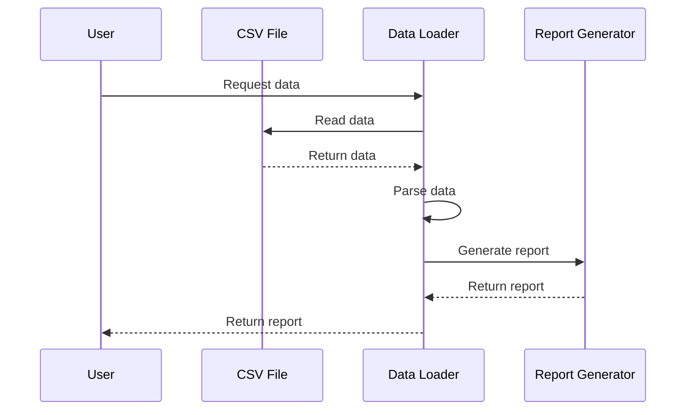

## Data Loader Example
This is a sample project that demonstrates how to read, parse, and generate reports from CSV data files. The project is written in TypeScript, making use of its strong typing features to ensure data consistency and integrity.

### Features
Reads data from CSV files
Parses the data into a usable format
Generates reports from the parsed data

### Tech Stack
TypeScript
Node.js
### Getting Started
To get started with this project, follow these steps:

Clone the repository: ```git clone https://github.com/amarpreetbhatia/data-loader-in-typescript.git```
Install the dependencies: ```npm install```
Run the project: ```npm start```

### Sequence Diagram
Here's a simple sequence diagram that illustrates the flow of the data loader:




This diagram shows the user requesting data, the data loader reading the data from a CSV file, parsing the data, generating a report, and returning the report to the user.
